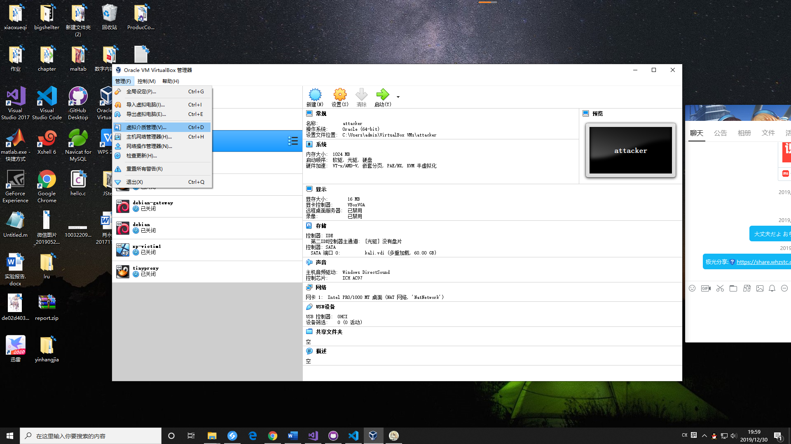

# 基于 VirtualBox 的网络攻防基础环境搭建

## 实验目的

掌握 VirtualBox 虚拟机的安装与使用；

掌握 VirtualBox 的虚拟网络类型和按需配置；

掌握 VirtualBox 的虚拟硬盘多重加载；

## 实验环境

以下是本次实验需要使用的网络节点说明和主要软件：

VirtualBox 虚拟机

攻击者主机（Attacker）：Kali

网关（Gateway, GW）：Debian

靶机（Victim）： xp / Kali

## 实验要求

1.虚拟硬盘配置成多重加载

2.搭建满足如下拓扑图所示的虚拟机网络拓扑

3.完成以下网络连通性测试；

- [x] 靶机可以直接访问攻击者主机

- [x] 攻击者主机无法直接访问靶机

- [x] 网关可以直接访问攻击者主机和靶机

- [x] 靶机的所有对外上下行流量必须经过网关

- [x] 所有节点均可以访问互联网

## 实验过程

### 一、多重加载

1.选中要多重加载的虚拟机，此时我们以debian-gateway虚拟机为例。此时的虚拟机还是普通类型，点击管理，虚拟介质管理

2.在弹出的窗口中选中想要多重加载的vdi文件，下方类型中选择多重加载，然后点击应用。

3.在弹出的窗口中点击释放

4.此时再选中虚拟机，在设置中选择存储，可以看到现在没有盘片。在控制器这里点击后面的第二个加号，选择添加虚拟硬盘

5.选择使用现有的虚拟硬盘

6.选择debian10.vdi并选择打开

7.此时可以看到debian虚拟机已经变为多重加载模式

### 二、网络设置

以设置kali-attacker的网络为例：

1.选中kali-attacker，点击设置，网络，网卡1设置为NAT网络，界面名称为NATNetwork

2.网卡2设置为仅主机（Host-Only）网络，界面名称为Virtual Host-Only Ethernet Adapter

3.网卡3设置为仅主机（Host-Only）网络，界面名称为Virtual Host-Only Ethernet Adapter #2

4.设置完成后效果如图（其实后两个没用）

### 三、各节点的网络情况

attacker

gateway

kali-victim1

kali-victim2

xp-victim1

xp-victim2

### 四、网络连通性测试

先关闭xp-victim1和xp-victim2的防火墙，避免因为防火墙而出现ping不通的情况

- [x] 靶机可以直接访问攻击者主机
所有靶机都ping攻击者主机的IP地址（192.168.56.101）可以连通

- [x] 攻击者主机无法直接访问靶机

靶机分别ping靶机xp-victim1(ip地址为172.16.111.115)

靶机kali-victim1(ip地址为172.16.111.103)

靶机xp-victim2(ip地址为172.16.222.126)

靶机kali-victim2(ip地址为172.16.222.100)

均无法连通

- [x] 网关可以直接访问攻击者主机和靶机

网关分别ping攻击者主机(ip地址为192.168.231.3)

靶机xp-victim1(ip地址为172.16.111.115)

靶机kali-victim1(ip地址为172.16.111.103)

可以连通

靶机xp-victim2(ip地址为172.16.222.126)

靶机kali-victim2(ip地址为172.16.222.100)

可以连通

- [x] 靶机的所有对外上下行流量必须经过网关

右边的xp-victim ip地址为172.16.111.115，右边网关enp0s9对应的ip地址为172.16.111.1，176.16.111.115主机向172.16.111.1发送了一个ping包，左边是观测的证据。可以看到，在靶机进行ping淘宝首页的操作后，arp请求和dns解析均经过网关。

- [x] 所有节点均可以访问互联网

所有靶机，攻击者机器和网关ping百度均可以上网。

### 五、实验的拓扑结构

